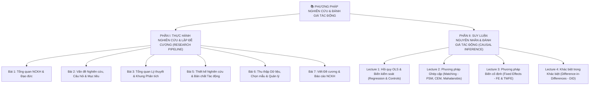
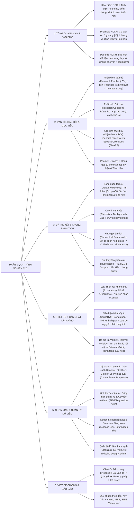
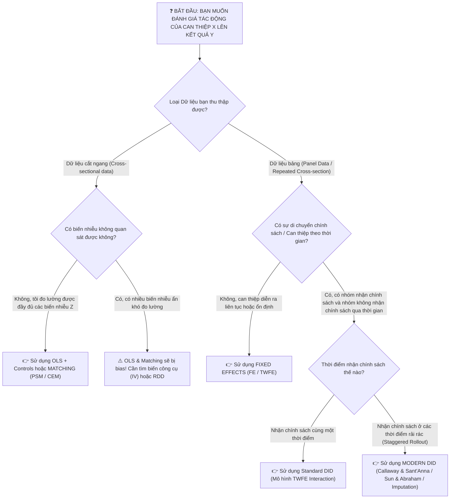

# 🧠 SƠ ĐỒ TƯ DUY SIÊU CHI TIẾT & CỤ THỂ TOÀN BỘ MÔN HỌC
## PHƯƠNG PHÁP NGHIÊN CỨU & ĐÁNH GIÁ TÁC ĐỘNG ĐỊNH LƯỢNG (RESEARCH METHODOLOGY & CAUSAL INFERENCE)

---

## 🗺️ 1. SƠ ĐỒ TỔNG THỂ CẤU TRÚC MÔN HỌC

---

## 🌳 2. SƠ ĐỒ TƯ DUY CHI TIẾT PHẦN I: LẬP ĐỀ CƯƠNG & QUY TRÌNH NGHIÊN CỨU

---

## 🔬 3. SƠ ĐỒ TƯ DUY CHI TIẾT PHẦN II: CÁC PHƯƠNG PHÁP SUY LUẬN NGUYÊN NHÂN (CAUSAL INFERENCE)

```mermaid
graph TD
    CI["🎯 SUY LUẬN NGUYÊN NHÂN & ĐÁNH GIÁ TÁC ĐỘNG"] --> FRAMEWORK["Gốc rễ: Khung Phản thực (Counterfactual Framework / Rubin Causal Model)"]
    FRAMEWORK --> PO["Potential Outcomes: Y(1) (khi nhận can thiệp) vs Y(0) (khi không nhận)"]
    FRAMEWORK --> FUNDAMENTAL["Vấn đề cốt lõi: Không thể quan sát đồng thời Y(1) và Y(0) trên cùng một đơn vị tại cùng mốc thời gian"]

    %% METHOD 1
    CI --> M1["1️⃣ HỒI QUY OLS & CONTROL VARIABLES"]
    M1 --> M1_A["Cơ chế: Tiêu chí cửa sau (Backdoor Criterion) - Đóng các đường cửa sau X ⬅️ A ➡️ Y"]
    M1 --> M1_B["Mô hình: Y = β0 + β1*X + γ*Controls + ε"]
    M1 --> M1_C["Thách thức: Sai lệch biến bị bỏ sót (Omitted Variable Bias - OVB)"]
    M1 --> M1_D["Hạn chế: Chỉ loại bỏ được biến nhiễu QUAN SÁT ĐƯỢC"]

    %% METHOD 2
    CI --> M2["2️⃣ PHƯƠNG PHÁP GHÉP CẶP (MATCHING METHODS)"]
    M2 --> M2_A["Cơ chế: Tìm nhóm Control có đặc điểm Z tương đồng nhất với nhóm Treated"]
    M2 --> M2_B["Giả định cốt lõi: Selection on Observables (CIA) & Common Support (Vùng hỗ trợ chung)"]
    M2 --> M2_C["Các phương pháp chính: PSM (Propensity Score), CEM (Coarsened Exact), Mahalanobis Distance"]
    M2 --> M2_D["Kiểm định quan trọng: Balance Test (So sánh t-test / Standardized Mean Difference trước & sau ghép)"]
    M2 --> M2_E["Hạn chế: Không loại bỏ được biến nhiễu KHÔNG QUAN SÁT ĐƯỢC"]

    %% METHOD 3
    CI --> M3["3️⃣ PHƯƠNG PHÁP BIẾN CỐ ĐỊNH (FIXED EFFECTS - FE)"]
    M3 --> M3_A["Loại dữ liệu: Dữ liệu bảng (Panel Data - theo dõi N cá nhân qua T thời kỳ)"]
    M3 --> M3_B["Cơ chế: Phép biến đổi Demeaning / Within Transformation (Y_it - Y_mean_i)"]
    M3 --> M3_C["Sức mạnh vượt trội: Triệt tiêu biến nhiễu KHÔNG QUAN SÁT ĐƯỢC nhưng CỐ ĐỊNH THEO THỜI GIAN (α_i)"]
    M3 --> M3_D["TWFE (Two-Way FE): Đưa vào cả Unit Fixed Effects (α_i) và Time Fixed Effects (δ_t)"]
    M3 --> M3_E["Kiểm định: Hausman Test (So sánh Fixed Effects vs Random Effects)"]

    %% METHOD 4
    CI --> M4["4️⃣ KHÁC BIỆT TRONG KHÁC BIỆT (DIFFERENCE-IN-DIFFERENCES - DID)"]
    M4 --> M4_A["Cơ chế 4 Cell Means: δ_DID = (Y_T,post - Y_T,pre) - (Y_C,post - Y_C,pre)"]
    M4 --> M4_B["Mô hình Hồi quy: Y_it = α + β1*Treated + β2*Post + β3*(Treated × Post) + ε"]
    M4 --> M4_C["Giả định TỐI CAO: Xu hướng song song (Parallel Trends Assumption)"]
    M4 --> M4_D["Công cụ kiểm định: Event Study / Dynamic DID (Khai thác pre-trends), Placebo Test"]
    M4 --> M4_E["DID Hiện đại: Xử lý Can thiệp rải rác (Staggered Adoption) bằng Callaway & Sant'Anna (C&S)"]
```

---

## ⚡ 4. BẢNG NỐI LÝ THUYẾT & THỰC HÀNH (KHI NÀO DÙNG PHƯƠNG PHÁP NÀO?)

---

## 📑 5. CẤU TRÚC CHI TIẾT MỘT ĐỀ CƯƠNG NGHIÊN CỨU KHAI THÁC PHƯƠNG PHÁP ĐỊNH LƯỢNG NÂNG CAO

1. **CHƯƠNG 1: GIỚI THIỆU ĐỀ TÀI**
   * 1.1. Bối cảnh & Lý do chọn đề tài
   * 1.2. Vấn đề nghiên cứu & Khoảng trống tri thức (Research Gap)
   * 1.3. Câu hỏi nghiên cứu (Research Questions) & Mục tiêu nghiên cứu (Research Objectives)
   * 1.4. Đối tượng, Phạm vi & Đóng góp của đề tài
2. **CHƯƠNG 2: TỔNG QUAN LÝ THUYẾT & KHUNG NGHIÊN CỨU**
   * 2.1. Các cơ sở lý thuyết nền tảng (Foundational Theories)
   * 2.2. Tổng quan các nghiên cứu thực nghiệm liên quan (Empirical Literature Review)
   * 2.3. Khung phân tích & Các giả thuyết nghiên cứu ($H_1, H_2,...$)
3. **CHƯƠNG 3: PHƯƠNG PHÁP NGHIÊN CỨU & MÔ HÌNH ƯỚC LƯỢNG**
   * 3.1. Nguồn dữ liệu & Quy trình chọn mẫu
   * 3.2. Mô hình nghiên cứu & Định nghĩa các biến số
   * 3.3. Chiến lược định danh nhân quả (Causal Identification Strategy):
     * *Nếu dùng OLS/PSM:* Mô tả các biến kiểm soát & quy trình ghép cặp, kiểm định Balance.
     * *Nếu dùng Fixed Effects:* Mô tả phép Demeaning & Unit/Time Fixed Effects.
     * *Nếu dùng DID:* Chứng minh Parallel Trends, mô tả mô hình Event Study & xử lý Staggered Adoption.
   * 3.4. Các kiểm định tính vững (Robustness Checks)
4. **KẾ HOẠCH THỰC HIỆN & TÀI LIỆU THAM KHẢO (APA 7th)**
